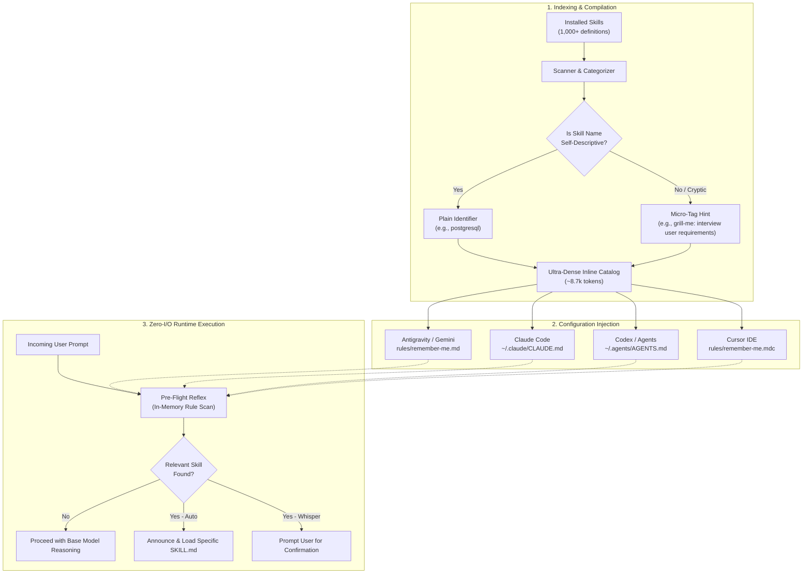
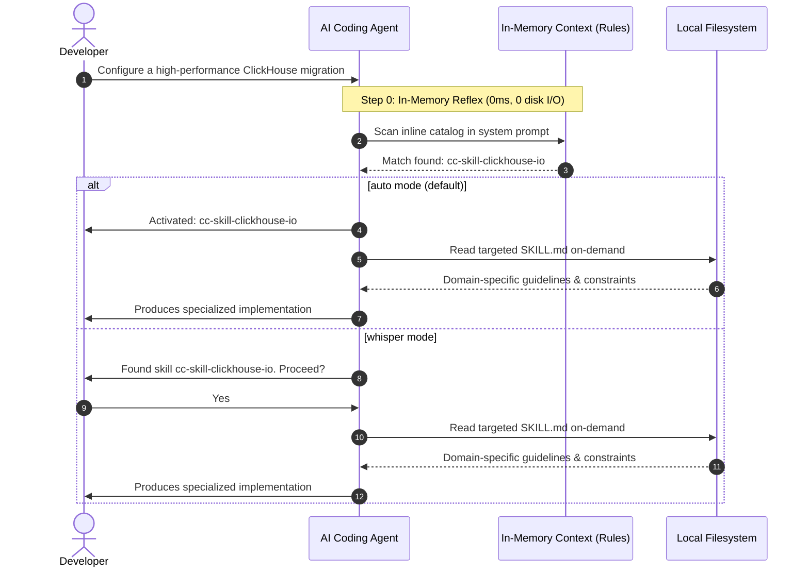

# Remember-Me

An autonomous skill discovery and recall system for AI coding agents, including Google Antigravity, Claude Code, OpenAI Codex, and Cursor.

Remember-Me indexes installed skills into an ultra-compact, categorized catalog embedded directly inside agent instruction files. It eliminates runtime file reads, avoids token truncation, and ensures agents recognize and load domain-specific skills when relevant tasks arise.

[](LICENSE)
[]()
[]()

---

## Background and Motivation

AI coding agents support specialized skills—modular instruction sets and tool definitions stored in markdown files (`SKILL.md`). In active development environments, skill libraries often grow to hundreds of entries across various domains. At this scale, standard agent architectures encounter three major limitations:

1. **Context Window Truncation**: Most agent runtimes inject every skill's name and description directly into the initial system prompt. Once the token budget is reached, platforms drop the remainder. In environments with 500 to 1,000+ skills, up to 70% of installed skills can be omitted from context before any prompt processing begins.
2. **Attentional Dilution**: Injecting extensive multi-paragraph descriptions into the system prompt degrades semantic retrieval. Models frequently overlook relevant skills or default to generic implementations.
3. **The File I/O Overhead**: Early approaches stored skill lists in an external index file (such as `SKILLS_INDEX.md`) and instructed the agent to read the file on each turn. While this prevented context truncation, it introduced disk I/O latency and consumed 15,000–25,000 tokens of file read overhead on every turn.

Remember-Me v2 resolves these trade-offs by compiling a compressed, categorized catalog directly into persistent agent rule files.

---

## Architecture

Remember-Me organizes and embeds skills through an automated compilation pipeline:



### Core Design Principles

- **Zero-I/O Inline Discovery**: By embedding skill names directly into system rules, the agent checks available workflows without issuing file read commands.
- **Selective Micro-Tag Disambiguation**: Descriptive skill names (`postgresql`, `docker-expert`, `tailwind-patterns`) remain plain text. Non-descriptive or metaphorical names (`grill-me`, `vexor`, `clarity-gate`) receive short intent annotations (e.g., `grill-me (interview user requirements)`, `vexor (vector code search)`). This preserves semantic recall while keeping the index under 9,000 tokens for over 1,000 skills.
- **On-Demand Loading**: The catalog serves as a directory pointer. The full specification (`SKILL.md`) is read into context only when the agent decides to execute that specific workflow.

---

## Performance Benchmarks

Measured on a workstation with **1,050 installed skills** (991 global skills + 59 plugin skills):

| Metric | Platform Default | External Index (v1) | Remember-Me v2 (Inline) |
| :--- | :---: | :---: | :---: |
| **System prompt tokens** | ~58,000 | ~200 | **~8,700** |
| **Per-turn file read operations** | 0 | 1 | **0** |
| **Tokens read per turn (disk I/O)** | 0 | ~20,200 | **0** |
| **Total per-turn token consumption** | ~58,000 | ~20,400 | **~8,700** *(Prompt cached)* |
| **Discoverable skills** | 355 / 1,050 (34%) | 1,050 / 1,050 (100%) | **1,050 / 1,050 (100%)** |
| **Discovery latency** | 0 ms | 50–200 ms | **0 ms** |

### Per-Turn Token Overhead (1,050 Skills)

```text
Platform Default   [██████████████████████████████] 58,000 tokens (Context budget truncation)
Remember-Me v1     [██████████░░░░░░░░░░░░░░░░░░░░] 20,400 tokens (Disk I/O penalty every turn)
Remember-Me v2     [████░░░░░░░░░░░░░░░░░░░░░░░░░░]  8,700 tokens (Zero disk I/O, prompt-cached)
```

### Skill Discoverability at Scale (1,050 Skills)

```text
Platform Default   [███████░░░░░░░░░░░░░]  34% (355 / 1,050 visible — 66% dropped)
Remember-Me v2     [████████████████████] 100% (1,050 / 1,050 visible)
```

Under modern LLM pricing where prompt caching applies to repeated rule prefixes, the effective marginal cost of the inline index is minimal, while ensuring 100% of installed skills remain discoverable.

---

## Operational Workflow



### Modes of Operation

- **Auto Mode (Default)**: The agent autonomously checks incoming requests against the catalog, announces the activation, and loads the corresponding `SKILL.md` immediately.
- **Whisper Mode**: For workflows requiring explicit human confirmation, the agent flags matching skills and prompts the developer before reading or applying rules.

Switch modes dynamically via prompt or slash commands:
- `/remember-me auto` (or `/remember-me-auto`)
- `/remember-me whisper` (or `/remember-me-whisper`)
- `/remember-me sync` (triggers catalog rebuild)

---

## Installation

### Prerequisites

- Python 3.8 or higher.
- At least one supported agent installed (Antigravity, Claude Code, Codex, or Cursor).
- No external Python dependencies required (standard library only).

### Quick Setup

Clone the repository and run `install.py`:

```bash
git clone https://github.com/stockfishZ/Remember-Me.git
cd Remember-Me
python install.py
```

### Installation Steps Executed by `install.py`

1. Scans the local environment to detect installed agent configurations (`~/.gemini`, `~/.claude`, `~/.agents`, `~/.codex`, and `~/.cursor`).
2. Copies `SKILL.md` and synchronization utilities into each agent's local skill directory.
3. Injects standardized behavioral rules into configuration files using bounded boundary markers (`<!-- REMEMBER-ME-START -->` and `<!-- REMEMBER-ME-END -->`).
4. Executes `sync_skills_index.py` to index all installed skills, generate micro-tags, and embed the categorized catalog into active rules.
5. Cleans up obsolete external index files (`SKILLS_INDEX.md`) if present.

### Uninstallation

To restore modified configuration files and remove all Remember-Me artifacts:

```bash
python install.py --uninstall
```

---

## Categorization Taxonomy

The synchronization script categorizes skills into 10 structured domains:

| Category | Typical Workflows and Domains |
| :--- | :--- |
| **Security & Pentesting** | OWASP auditing, XSS/IDOR verification, IAM review, threat modeling, vulnerability scanning |
| **Database & Storage** | PostgreSQL, MySQL, Redis, ClickHouse, Prisma, schema migrations, query optimization |
| **Cloud & DevOps** | Docker, Kubernetes, Terraform, Helm, AWS, Azure, GCP, CI/CD pipelines |
| **AI, Agents & LLM** | LangChain, LangGraph, CrewAI, RAG architectures, prompt engineering, agent evaluations |
| **Testing & QA** | TDD patterns, Playwright, Jest, Pytest, unit tests, code review checklists |
| **Backend & API** | Node.js, FastAPI, Go, Rust, .NET, Laravel, GraphQL, REST, DDD patterns |
| **Frontend & UI** | React, Vue, Next.js, Tailwind CSS, modern CSS, animations, design tokens |
| **Integrations & CRM** | GitHub PRs, Linear, Jira, Notion, Slack, Stripe, HubSpot, Salesforce |
| **Science & Biology** | Genomics, UniProt, BLAST, PDB structures, literature search, chemistry |
| **Developer Tools** | Shell automation, CLI utilities, scrapers, documentation generators, git workflows |

---

## Synchronizing the Catalog

When new skills or plugins are added or modified, update your agent rule files by running:

```bash
python sync_skills_index.py
```

### Command-Line Arguments

```text
usage: sync_skills_index.py [-h] [--workspace PATH] [--output PATH]
                            [--gemini] [--claude] [--codex]

Options:
  --workspace PATH   Target a specific workspace directory (updates local AGENTS.md / CLAUDE.md)
  --output PATH      Write the generated rule file to a custom path
  --gemini           Force injection into Antigravity/Gemini configuration
  --claude           Force injection into Claude Code configuration
  --codex            Force injection into Codex configuration
```

Example workspace synchronization:

```bash
python sync_skills_index.py --workspace /path/to/project
```

---

## Platform Support

| Agent / Environment | Target Configuration File | Integration Method |
| :--- | :--- | :--- |
| **Google Antigravity** | `~/.gemini/config/rules/remember-me.md` | Native global rule with embedded catalog |
| **Claude Code** | `~/.claude/CLAUDE.md` | Injected marker block (`<!-- REMEMBER-ME-START -->`) |
| **OpenAI Codex / Agents CLI** | `~/.agents/AGENTS.md` and `~/.codex/AGENTS.md` | Injected marker block |
| **Cursor IDE** | `~/.cursor/rules/remember-me.mdc` | Persistent cursor rule (`alwaysApply: true`) |
| **Project Workspaces** | `<workspace>/AGENTS.md` or `<workspace>/CLAUDE.md` | Workspace-level rule injection via `--workspace` |

---

## License

This project is licensed under the [MIT License](LICENSE).
