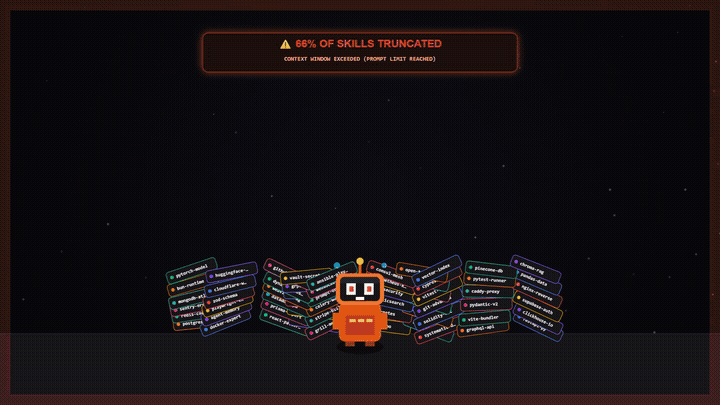

# Remember-Me

An autonomous skill discovery and recall system for AI coding agents, including Google Antigravity, Claude Code, OpenAI Codex, and Cursor.

Remember-Me compiles installed skills into an ultra-compact, categorized catalog embedded directly inside agent instruction files. It eliminates runtime file reads, prevents token truncation, and ensures agents recognize and load domain-specific workflows when relevant tasks arise.

[](LICENSE)
[]()
[]()

<div align="center">

<br />

[](brag-output-v3/brag.mp4)

<br />

</div>

---

## Background

AI coding agents use specialized skills—modular instruction sets and tool definitions stored in `SKILL.md` files—to handle domain-specific workflows like database migrations, vulnerability audits, or frontend animations.

As skill collections grow past a few dozen entries, default platform architectures break down in two ways:

1. **Context Truncation**: Most agent platforms attempt to load the name and complete summary of every installed skill into the initial system prompt. Once the token budget is reached, platforms drop the rest without warning. In environments with 500 to 1,000+ skills, up to 70% of installed skills become completely invisible to the agent.
2. **Context Dilution and File I/O**: Injecting thousands of lines of documentation into the prompt degrades retrieval accuracy and causes agents to miss relevant skills. Early workarounds placed skill lists in an external file (like `SKILLS_INDEX.md`) and instructed the agent to read it each turn. While this avoided prompt truncation, it introduced disk latency and added 15,000 to 25,000 tokens of file read overhead to every message turn.

Remember-Me v2 resolves these trade-offs by compiling installed skills into an ultra-compact, categorized index stored directly inside the agent's persistent rule files.

---

## How It Works

Remember-Me uses an automated compilation script (`sync_skills_index.py`) to crawl installed skill directories across global and workspace configurations.

Instead of writing out full documentation blocks, the compiler groups skill identifiers into ten functional categories (such as Database, Security, Cloud, and Frontend).

Self-descriptive names like `postgresql` or `docker-expert` remain plain text. For abstract or metaphorical names where an LLM cannot infer intent from the name alone—such as `grill-me` or `vexor`—the compiler attaches a concise 2–4 word parenthetical tag (for example, `grill-me (interview user requirements)` or `vexor (vector code search)`).

The compiled index is injected directly into each agent's native rule configuration:
- **Google Antigravity**: `~/.gemini/config/rules/remember-me.md`
- **Claude Code**: `~/.claude/CLAUDE.md` (bounded by injection markers)
- **OpenAI Codex / Agents CLI**: `~/.agents/AGENTS.md` and `~/.codex/AGENTS.md`
- **Cursor IDE**: `~/.cursor/rules/remember-me.mdc`

Because the index lives directly in the rule configuration, the agent discovers available skills instantly in memory without executing any file reads or tool calls. The full `SKILL.md` file is loaded only when the agent decides to activate that specific workflow.

---

## Performance Benchmarks

Measured on a workstation with **1,050 installed skills** (991 global skills + 59 plugin skills):

| Metric | Platform Default | External Index (v1) | Remember-Me v2 (Inline) |
| :--- | :---: | :---: | :---: |
| **System prompt tokens** | ~58,000 | ~200 | **~8,700** |
| **Per-turn file read operations** | 0 | 1 | **0** |
| **Tokens read per turn (disk I/O)** | 0 | ~20,200 | **0** |
| **Total per-turn token consumption** | ~58,000 | ~20,400 | **~8,700** *(Prompt cached)* |
| **Discoverable skills** | 355 / 1,050 (34%) | 1,050 / 1,050 (100%) | **1,050 / 1,050 (100%)** |
| **Discovery latency** | 0 ms | 50–200 ms | **0 ms** |

In testing with 1,050 skills, platform default loading exceeded prompt budgets and silently discarded 695 skills (66% of the library). Remember-Me v1 kept all skills discoverable but incurred a ~20,000 token disk read penalty on every turn.

Remember-Me v2 embeds the entire 1,050-skill library into roughly 8,700 tokens. Modern LLM runtimes automatically apply prompt caching to persistent system rules, meaning the marginal cost of these tokens is discounted by ~90% on subsequent turns while retaining 100% discoverability and zero disk latency.

---

## Operational Modes

Remember-Me supports two execution modes:

### Auto Mode (Default)

The agent reviews incoming requests against its in-memory index. When a task requires specialized domain guidance, the agent announces the activation and reads the corresponding `SKILL.md` from disk to adopt its guidelines:

```text
User:  "Help me configure a high-performance ClickHouse migration."
Agent: "⚡ [remember-me] Activated: cc-skill-clickhouse-io
        Reading specialized guidelines..."
```

### Whisper Mode

In environments where developers prefer explicit confirmation before an agent changes its workflow or reads extra files, whisper mode prompts before loading instructions:

```text
User:  "Help me configure a high-performance ClickHouse migration."
Agent: "💡 [remember-me] Identified relevant skill: 'cc-skill-clickhouse-io'.
        Proceed with this workflow? (yes/no)"
```

### Switching Modes

You can toggle modes directly in conversation or via slash commands:

- `/remember-me auto` (or `/remember-me-auto`)
- `/remember-me whisper` (or `/remember-me-whisper`)
- `/remember-me sync` (triggers an index rebuild)

---

## Installation

### Prerequisites

- Python 3.8 or higher.
- At least one supported agent installed (Antigravity, Claude Code, Codex, or Cursor).
- No external Python dependencies required (standard library only).

### Quick Setup

Clone the repository and run `install.py`:

```bash
git clone https://github.com/stockfishZ/Remember-Me.git
cd Remember-Me
python install.py
```

`install.py` inspects your home directory for installed agents, deploys the `remember-me` skill package, configures the rule files with bounded boundary markers (`<!-- REMEMBER-ME-START -->` and `<!-- REMEMBER-ME-END -->`), and runs an initial synchronization.

### Uninstallation

To cleanly remove Remember-Me configurations and restore original rule files:

```bash
python install.py --uninstall
```

---

## Categorization Taxonomy

The compiler organizes skills into ten primary domains:

| Category | Workflows and Topics Covered |
| :--- | :--- |
| **Security & Pentesting** | OWASP guidelines, XSS/IDOR verification, IAM review, threat modeling, vulnerability scanning |
| **Database & Storage** | PostgreSQL, MySQL, Redis, ClickHouse, Prisma, schema migrations, query optimization |
| **Cloud & DevOps** | Docker, Kubernetes, Terraform, Helm, AWS, Azure, GCP, CI/CD pipelines |
| **AI, Agents & LLM** | LangChain, LangGraph, CrewAI, RAG architectures, prompt engineering, agent evaluations |
| **Testing & QA** | TDD workflows, Playwright, Jest, Pytest, unit tests, code review checklists |
| **Backend & API** | Node.js, FastAPI, Go, Rust, .NET, Laravel, GraphQL, REST, DDD patterns |
| **Frontend & UI** | React, Vue, Next.js, Tailwind CSS, modern CSS, animations, design tokens |
| **Integrations & CRM** | GitHub PRs, Linear, Jira, Notion, Slack, Stripe, HubSpot, Salesforce |
| **Science & Biology** | Genomics, UniProt, BLAST, PDB structures, literature search, chemistry |
| **Developer Tools** | Shell automation, CLI utilities, scrapers, documentation generators, git workflows |

---

## Synchronizing the Catalog

Whenever you install, update, or remove skills, update your agent rule files by running:

```bash
python sync_skills_index.py
```

### Command-Line Arguments

```text
usage: sync_skills_index.py [-h] [--workspace PATH] [--output PATH]
                            [--gemini] [--claude] [--codex]

Options:
  --workspace PATH   Target a specific workspace directory (updates local AGENTS.md / CLAUDE.md)
  --output PATH      Write the generated rule file to a custom path
  --gemini           Force injection into Antigravity/Gemini configuration
  --claude           Force injection into Claude Code configuration
  --codex            Force injection into Codex configuration
```

Example workspace synchronization:

```bash
python sync_skills_index.py --workspace /path/to/project
```

---

## Platform Support

| Agent / Environment | Target Configuration File | Integration Method |
| :--- | :--- | :--- |
| **Google Antigravity** | `~/.gemini/config/rules/remember-me.md` | Native global rule with embedded catalog |
| **Claude Code** | `~/.claude/CLAUDE.md` | Injected marker block (`<!-- REMEMBER-ME-START -->`) |
| **OpenAI Codex / Agents CLI** | `~/.agents/AGENTS.md` and `~/.codex/AGENTS.md` | Injected marker block |
| **Cursor IDE** | `~/.cursor/rules/remember-me.mdc` | Persistent cursor rule (`alwaysApply: true`) |
| **Project Workspaces** | `<workspace>/AGENTS.md` or `<workspace>/CLAUDE.md` | Workspace-level rule injection via `--workspace` |

---

## License

This project is licensed under the [MIT License](LICENSE).
